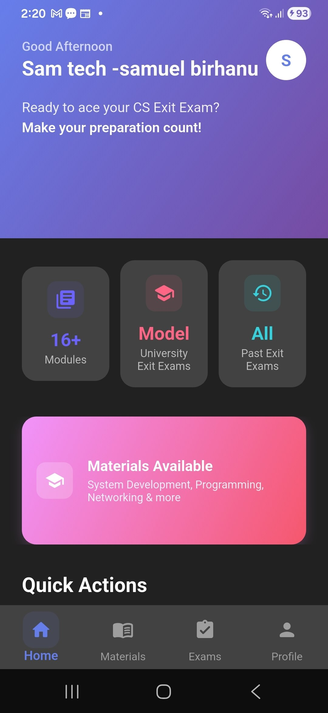
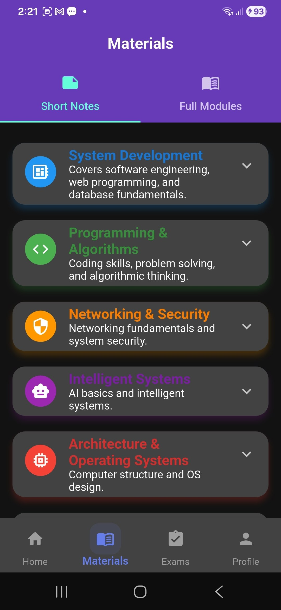
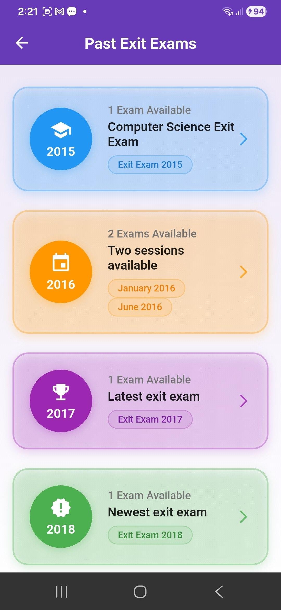
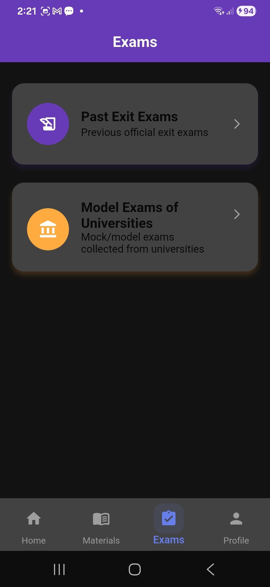
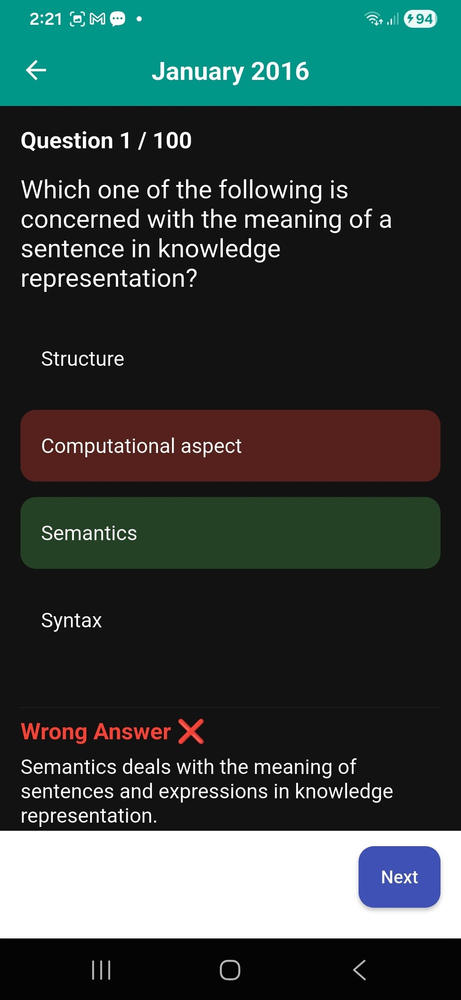
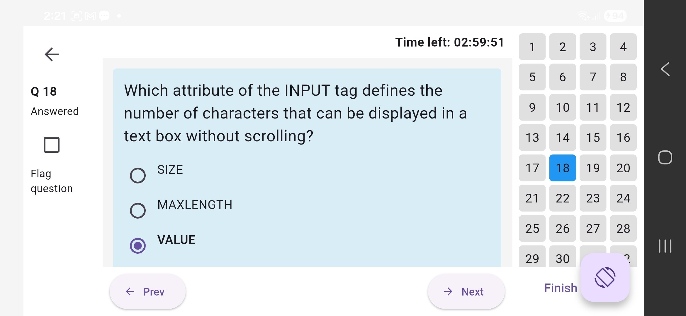

 

 

> **The #1 study companion for Ethiopian Computer Science students preparing for the national CS Exit Exam.**

 

---

## 📱 Screenshots

| Home | Materials | Past Exams |
|------|-----------|------------|
|  |  |  |

| Exams | Practice Mode | Exam Mode |
|-------|--------------|-----------|
|  |  |  |

---

## ✨ Features

### 📚 Learning Modules — 16+ Topics
Covers all major areas of the official CS exit exam blueprint:

- 🖥️ System Development — Software engineering, web programming, database fundamentals
- 💻 Programming & Algorithms — Coding skills, problem solving, algorithmic thinking
- 🌐 Networking & Security — Networking fundamentals and system security
- 🤖 Intelligent Systems — AI basics and intelligent systems
- ⚙️ Architecture & Operating Systems — Computer structure and OS design
- _...and more_

### 📝 Past Exam Question Bank
Real past exit exams organized by year:

| Year | Sessions |
|------|----------|
| 2015 | 1 exam |
| 2016 | 2 sessions (January & June) |
| 2017 | 1 exam |
| 2018 | 1 exam |

### 🎯 Two Exam Modes
- **Practice Mode** — Go at your own pace, instant feedback after each question
- **Exam Mode** — Full timed simulation (3 hours), 100 questions, exam-style scoring

### 🧠 Learning Support
- ✅ Step-by-step explanations for every question
- ✅ Short notes & quick revision sheets per topic
- ✅ Instant feedback with correct answer shown

### 📊 Performance Tracking
- Weak topic detection
- Score history
- Progress dashboard showing completed topics & readiness level
- "Exam readiness" indicator

---

## 📲 How to Install

> ⚠️ Since this is an APK (not from Play Store), you need to allow installation from unknown sources.

**Step 1** — [Download the latest APK](https://github.com/samibirhanu1/cs-exit-exam-app/releases/latest)

**Step 2** — On your Android phone:
`Settings` → `Security` (or `Privacy`) → Enable **"Install unknown apps"** or **"Allow from this source"**

**Step 3** — Open the downloaded `.apk` file and tap **Install**

**Step 4** — Open the app and start studying! 🎓

> ✅ **Minimum Android version:** Android 6.0 (Marshmallow) or higher

---

## 🗺️ Roadmap

- [x] Past exam question bank (2015–2018)
- [x] Practice & Exam modes
- [x] Short notes & materials
- [x] Performance tracking
- [ ] AI-assisted explanations for hard questions
- [ ] Adaptive practice (more questions from weak areas)
- [ ] More past exam years
- [ ] iOS version

---

## 👨‍💻 Developer

**Samuel Birhanu Teffere**
CS Graduate | Flutter & Spring Boot Developer | Ethiopia

---

## ⭐ Support the Project

If this app helped you prepare for your exit exam, please:
- ⭐ **Star this repo** — it helps other students find the app
- 📢 **Share it** with your classmates and study groups
- 🐛 **Report bugs** via [GitHub Issues](https://github.com/samibirhanu1/cs-exit-exam-app/issues)

---

  <i>Built with ❤️ for Ethiopian CS students — Good luck on your exit exam! 🎓</i>

